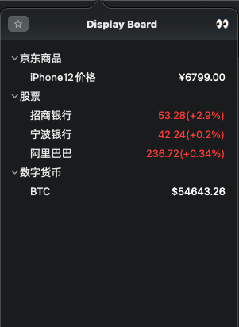

DisplayBoard(暂定名)作为一款简单的数据获取展示工具,使用纯SwiftUI的一次尝试,同时也是对既往数据获取整合工具的构想的实现.
其实现思路也很简单,通过将接口请求和返回值数据处理功能抽离出来,由JavaScript实现.由用户自行加入需要的js请求文件.App负责调用这些js代码,获取请求结果并有序直观展示在状态栏下拉列表中.如图所示:



JavaScript文件包含两部分内容,用户可以复制简单修改,放在指定的文件夹后刷新即可同步.
**元数据注解**,包含展示的name和用于分组的tag,后续会支持更多功能.
```js
/**
{
    "name":"特斯拉",
    "tag":"股票"
}
**/
```

**数据请求**,以main函数为入口的请求函数,基本按需求替换URL和自定义数据处理返回字符串即可展示.
```js
function main(input) {
    fetch("https://example.com/xxx")
    .then(data=>{
        var response = JSON.parse(data)
        //.... do something with data
        var str = hanle(response) ;// for example, parse json ,exract numbler , handle precision
        input.text = str
    })
    .catch(e=>console.log(e))
}
```

然后就没有然后了由于过于简单,暂时没有更多的能力.以后也许会有进一步加强.再继续补充吧.
